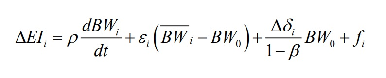
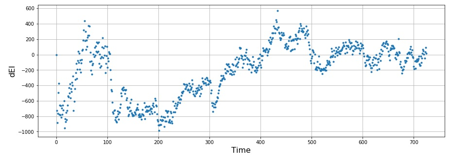
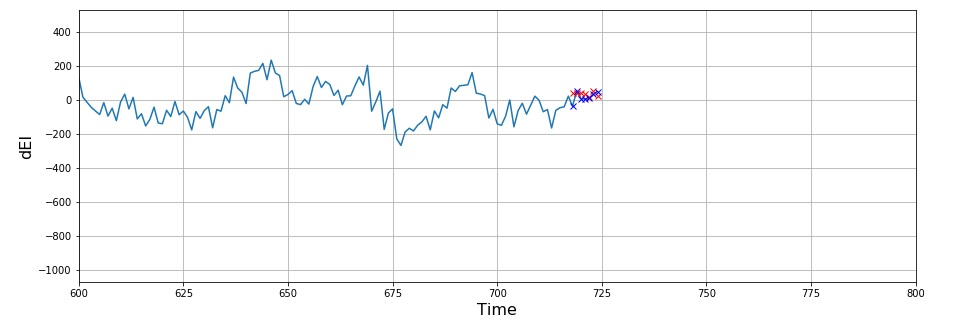

The prevalence of obesity has tripled in the last 40 years and it has been estimated that by 2050, 60% of males and 50% of females may be living with obesity. These increases to obesity are undoubtedly multifaceted and complex. Despite this complexity, a simple ineluctable law (first law of thermodynamics) underlies any change in human body weight; body weight can only change when the rate of energy intake exceeds the rate of energy expenditure. I.e. (change in energy stores = energy intake - energy expenditure).

Evidence suggests that once this weight has been gained, it is hard to lose and even harder to prevent weight regain after weight loss. So this poses the question, can we forecast energy intake with advanced neural network architectures and then intervene before weight is gained? Let's try it... 

First we need to be able to estimate energy intake...

### An introduction to modelling energy intake 

Above I introduced the first law of thermodynamics in the context of human bodyweight. This simple law dictates that if we know just two of these values, we can estimate the third, EI = EE + ΔES.

For this post energy expenditure is derived from a recently published accelerometery based machine learning algorithm [O'Driscoll, et al. 2020](https://www.tandfonline.com/doi/full/10.1080/02640414.2020.1746088) and energy intake can be approximated from a validated mathematical model [Sanghvi, et al. 2015](https://academic.oup.com/ajcn/article/102/2/353/4564610) 

 

The above model describes a linearised model to estimate change in energy intake relative to baseline requirements for the ith interval.

The ρ parameter in this model describes the change energy density associated with the estimated change in body composition and *BW* refers to body weight. The parameter ε describes how the rate of energy expenditure depends on the body weight.

The Δδ term describes changes to energy expenditure over time (derived from the algorithm in the paper above). The parameter β accounts for additional energy cost of digestive and adaptive processes. The parameter *f* refers to additional contributions to energy expenditure, which in our case is 0.

### What is a long term short memory neural network?

Before I describe more complex neural network architectures it is important define a more basic neural network. Neural networks  describe a range of algorithms inspired by the biological structure of human neurons. A network will consist of hundreds or thousands of simple, interconnected processing nodes, which are associated with weights which are continually adjusted in the training process to derive outputs. 

A primary limitation of standard neural network models is their limited ability to process sequential, time-series data. This is where recurrent neural networks (RNN) come in. RNN models can learn from sequence of data (i.e. time series) so that each sample can be assumed to be dependent on previous ones. The named 'recurrent' is given because they perform the same task for every element of a sequence, allowing the current prediction to be modelled on the previous outputs.

Long term short memory neural networks (LSTM) build on RNNs and allow a network to retain long-term dependencies at a given time from many timesteps before. RNNs were designed to that effect using a simple feedback approach for neurons where the output sequence of data serves as one of the inputs. However, long term dependencies can make the network untrainable due to the vanishing gradients and difficulties in modelling variables far back in the sequence. LSTM is designed precisely to solve that problem.

A more detailed summary of recurrent neural networks and LSTM can be found [here](https://medium.com/mlreview/understanding-lstm-and-its-diagrams-37e2f46f1714). 

### Energy intake data

The model above allows us to approximate 7 day averages in energy intake. We know that variability will exist in the true energy intake day to day so we can interpolate day to day values but add some noise to address this random variation. So our change in energy intake variable now looks like this: 

 

### Forecasting

Before we train a network, it is important to scale out variable with `MinMaxScaler()` from the sklearn module. This will scale the variable to have a range 0,1 and assists in network convergence. 

LSTM requires both features and labels in order to learn. In the context of time series forecasting, it is important to provide the past values as features and future values as labels, so LSTM’s can learn how to predict the future. The keras implementation of LSTM requires a 3D tensor (sample size * time steps * predictive variables)/ The code below will split our data into the required shape, with `n_steps` defining the number of inputs into our sequence.

Before we run the network we define a training set (which the network will learn from) and a testing set, which is the most recent timepoints on which we test our network's predictions. Once we have a training set (the vector `s_t` below)  we can apply the `split` function to set up the data 

~~~python
def split(series, time_steps):
    X, y = list(), list()
    for i in range(len(series)):
        end_ind = i + time_steps # get end
        if end_ind > len(series)-1:
            break
        X.append(series[i:end_ind]) # append to the list
        y.append(series[end_ind]) # append to the list
    return np.array(X), np.array(y)

n_steps = 3
X, y = split(s_t, n_steps)
~~~

We now have our data ready for the LSTM!

We can run the model with the Keras implementation of LSTM. We use relu activation at each of the 100 nodes, set mean squared error as our loss function and use the adam optimiser. Note that for improved prediction, hyperparameters can be refined. 

~~~ python
n_features = 1
X = X.reshape((X.shape[0], X.shape[1], n_features))
model = Sequential()
model.add(LSTM(100, activation='relu', input_shape=(n_steps, n_features)))
model.add(Dense(1)) 
model.compile(optimizer='adam', loss='mse') 
model.fit(X, 
          y, 
          epochs=100)
~~~

After we have defined and trained our network, we can feed 3 new points to the network and ask it to predict the next value in the sequence, here we see the prediction with the red circle and the true value with the blue cross. 

  

The error in prediction here is -9.9 kcal/day. However, the interesting and useful analyses here would be to forecast more than one step ahead. If sufficient accuracy can be achieved then this has the potential to be used to intervene before weight is gained. 

### Multi-step output LSTM

This prediction involves numerous outputs for the network, so our data set up has to be slightly different. The function below can be used to define an array with a given number of inputs `n_steps_in`, and a given number of outputs `n_steps_out`. In our case we aim to forecast 7 days into the future with 21 days as input. 

~~~ python
# set data for lstm 
mult_lstm_seq(series, n_steps_in, n_steps_out):
    X, y = list(), list()
    for i in range(len(series)):
        ind = i + n_steps_in
        end_ind = ind + n_steps_out
        if end_ind > len(series):
            break
        X.append(series[i:ind])
        y.append(series[ind:end_ind])
    return np.array(X), np.array(y)

# Prepare the dataset for lstm 
n_steps_in, n_steps_out = 21, 7
X, y = mult_lstm_seq(s_t, n_steps_in, n_steps_out)
~~~

We can run the model with the Keras implementation of LSTM. We use [relu activation](https://medium.com/@danqing/a-practical-guide-to-relu-b83ca804f1f7#:~:text=ReLU%20stands%20for%20rectified%20linear,max(0%2C%20x).&text=ReLU%20is%20the%20most%20commonly,usually%20a%20good%20first%20choice.) at each of the 100 nodes, set mean squared error as our loss function and use the [adam optimiser](https://towardsdatascience.com/adam-latest-trends-in-deep-learning-optimization-6be9a291375c) for the network. Note that for improved prediction, hyperparameters can be refined but that is beyond the scope of this introductory post. You can see that I add another layer to the network here, which again has 100 nodes but our output layer is now outputting the number of outputs defined by `n_steps_out`

~~~ python
# define model - deeper network 
model = Sequential()
model.add(LSTM(100, activation='relu', return_sequences=True, input_shape=(n_steps_in, n_features)))
model.add(LSTM(100, activation='relu'))
model.add(Dense(n_steps_out))
model.compile(optimizer='adam', loss='mse')

model.fit(X, y, epochs=100, verbose=1)
~~~

Ok, so let's check the predictions on the test set. First, we need to transform our variable back to its original scale using the `inverse_transform` function. 

~~~ python
s_un = sc.inverse_transform(s.reshape(-1, 1))
pred_un = sc.inverse_transform(pred)
final_un = sc.inverse_transform(final.reshape(-1, 1))
~~~

The predictions can be seen below. The RMSE over 7 day forecast 35.29 kcal/day, which isn't too bad 

  

We can see our exact deviations at each daily prediction below: 

~~~ python 
Deviation at prediction point 0  is equal to:  77.00088774161992 kcal/day
Deviation at prediction point 1  is equal to:  -14.500476578683639 kcal/day
Deviation at prediction point 2  is equal to:  31.241940661731483 kcal/day
Deviation at prediction point 3  is equal to:  27.205713040355203 kcal/day
Deviation at prediction point 4  is equal to:  7.0701560600501505 kcal/day
Deviation at prediction point 5  is equal to:  19.855179293375905 kcal/day
Deviation at prediction point 6  is equal to:  -23.866922631354946 kcal/day
~~~

### Conclusions

In this post I introduced univariate LSTM neural networks for forecasting human energy intake. Moderate accuracy was achieved in in the next outcomes. Importantly, we did not refine the hyperparameters or experiment with multivariate inputs and additional subjects, which is an aim for the future! 

I would like to extend huge thanks to Aurelien Geron (Hands-on ML) and Jason Brownlee (Machine learning mastery) for their amazing machine learning recourses. 

You can view the full code [here](https://github.com/RJODRISCOLL/Time-series-forecasting-/blob/master/LSTM%20EI.ipynb)
